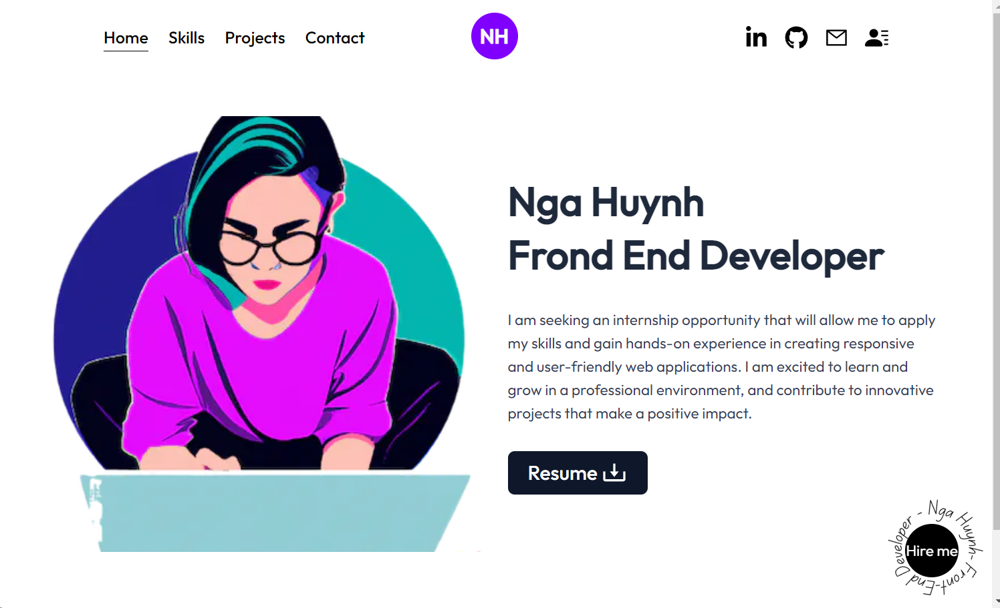

# My portfolio website built using Next.js and Tailwind CSS.

It consists of four main pages - Home, Skills, Projects, and Contact - each designed to showcase my skills, experience, and projects.

The Home page provides a brief introduction to myself and my work, with links to my social media profiles and resume. The Skills page lists my areas of expertise and technical skills.

The Projects page displays a selection of my recent projects, including a brief description and links to view the live website. Finally, the Contact page includes a simple contact form for visitors to get in touch with me.

Overall, this portfolio website is designed to showcase my skills and experience in web development, and to provide a platform for potential employers or clients to learn more about me and my work.

